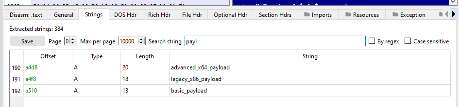

# 🔬 System Gatherer - Complete Analysis Report

**Educational malware sample demonstrating Windows system enumeration techniques**

## 📊 Executive Summary

This sample demonstrates core malware reconnaissance capabilities through:
- **Registry-based OS detection** bypassing GetVersionEx limitations
- **Process enumeration** for security software mapping  
- **System profiling** for target environment assessment
- **Data exfiltration** simulation via file output

---

## 🔍 Static Analysis Findings

### **PE Structure Analysis**
**Tool Used:** PE-bear v0.7.1


**Key Imports Identified:**
- **ADVAPI32.dll** (3 entries):
  - `RegOpenKeyExA` - Registry key access
  - `RegCloseKey` - Handle cleanup  
  - `RegQueryValueExA` - Value retrieval \


- **KERNEL32.dll** - System information and process enumeration APIs


**PE Characteristics:**
- **Entry Point:** Standard C++ runtime initialization
- **Sections:** `.text`, `.rdata`, `.data`, `.pdata` (typical MSVC layout)
- **Architecture:** x64 
- **Compiler Signature:** Microsoft Visual Studio 2022 Community

### **String Analysis Results**
**Tool Used:** Sysinternals Strings



**Critical Intelligence Signatures:** \
=== SYSTEM INFORMATION === \
=== TARGET ANALYSIS === \
=== RUNNING PROCESSES === \
SOFTWARE\Microsoft\Windows NT\CurrentVersion \
ProductName, CurrentBuild, ReleaseId, sys_intel.txt

**Development Artifacts:**
- Visual Studio 2022 build paths visible
- MSVC runtime library references
- Debug information remnants

**Detection Implications:**
- **String-based signatures** easily created from output headers
- **Registry path patterns** match known malware reconnaissance
- **File naming conventions** indicate data collection purpose

---

## 🖥️ Dynamic Analysis Results

### **Process Behavior Analysis**
**Tool Used:** Process Monitor (ProcMon)

**Registry Access Pattern:** \
Process: system-gatherer.exe \
Operation: RegOpenKeyEx \
Path: HKLM\SOFTWARE\Microsoft\Windows NT\CurrentVersion \
Result: SUCCESS

**Key Registry Reads:**
- `HKLM\SOFTWARE\Microsoft\Windows NT\CurrentVersion\ProductName`
- `HKLM\SOFTWARE\Microsoft\Windows NT\CurrentVersion\CurrentBuild`  
- `HKLM\SOFTWARE\Microsoft\Windows NT\CurrentVersion\ReleaseId`

**File System Activity:**
- **File Created:** `sys_intel.txt` in execution directory
- **Write Operations:** System information and process list
- **File Size:** ~2-4KB (varies by system)

**Process Enumeration:**
- **API Used:** `CreateToolhelp32Snapshot(TH32CS_SNAPPROCESS, 0)`
- **Behavior:** Iterates through all running processes
- **Data Collected:** Process IDs, executable names
- **Security Implication:** Maps potential security software

### **Sample Output Analysis**
**File:** `sys_intel.txt`
```=== SYSTEM INFORMATION ===
OS: Windows 10 Pro
Build: 19045
Release: 2009
Processors: 4
Architecture: x64
Computer Name: DESKTOP-SRBUQS4
=== RUNNING PROCESSES ===
PID: 0 | [System Process]
PID: 4 | System
PID: 108 | Registry
[... additional processes ...]
```